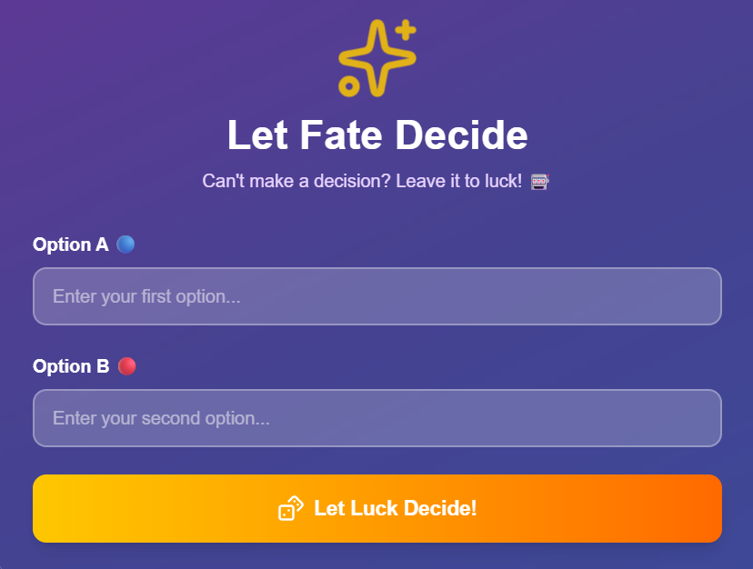
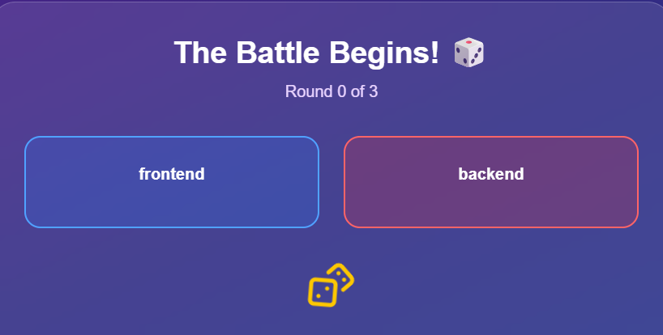
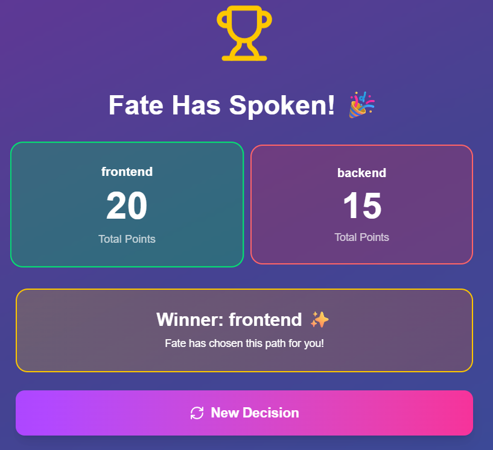

# 🎲 Let Fate Decide - Luck-Based Decision Maker

A fun and interactive Next.js web application that helps users make difficult decisions by leaving it up to fate! When you can't decide between two options, let luck determine the winner through a 3-round point battle system.

## ✨ Features


- **Simple Decision Input**: Enter any two options you're struggling to choose between
- **3-Round Battle System**: Each option receives random points (0-10) across 3 rounds
- **Animated Results**: Smooth animations showing points being revealed round by round
- **Random Point Generation**: Points range from 0 to 10, adding genuine suspense
- **Clear Winner Declaration**: The option with the highest total points wins
- **Tie Handling**: Displays a tie message when both options score equally
- **Beautiful UI**: Modern glassmorphism design with gradient backgrounds
- **Responsive Design**: Works perfectly on desktop, tablet, and mobile devices
- **Toast Notifications**: Clean notifications using nextjs-toast-notify
- **Reset Functionality**: Easy restart for making new decisions

## 🎯 How It Works

1. **Enter Your Options**: Type in two choices you're deciding between (e.g., "Take the job" vs "Stay current job")
2. **Let Luck Decide**: Click the button to start the fate battle
3. **Watch the Battle**: Each round, both options receive random points (0-10)
4. **See the Results**: After 3 rounds, the option with more total points wins
5. **Make Another Decision**: Use the reset button to start fresh

## 🎨 Tech Stack

- **Framework**: Next.js 16.0.4
- **React**: 19.2.0
- **Styling**: Tailwind CSS 4
- **Icons**: Lucide React 0.554.0
- **Notifications**: nextjs-toast-notify 1.57.0
- **Language**: TypeScript 5
- **Animations**: CSS transitions and transforms

## 🚀 Getting Started

### Prerequisites

- Node.js 18+ installed
- npm, yarn, pnpm, or bun package manager

### Installation
```bash
# Clone the repository
git clone https://github.com/mirbasit01/Luck-Based-Decision-Maker.git

# Navigate to project directory
cd Luck-Based-Decision-Maker

# Install dependencies
npm install
# or
yarn install
# or
pnpm install
# or
bun install
```

### Running the Development Server
```bash
npm run dev
# or
yarn dev
# or
pnpm dev
# or
bun dev
```

Open [http://localhost:3000](http://localhost:3000) in your browser to see the application.

### Building for Production
```bash
# Create production build
npm run build

# Start production server
npm run start
```

### Linting
```bash
npm run lint
```

## 📁 Project Structure
```
Luck-Based-Decision-Maker/
├── app/
│   ├── page.tsx         # Main decision maker component
│   ├── layout.tsx       # Root layout
│   └── globals.css      # Global styles
├── components/          # Reusable components
├── public/             # Static assets
├── package.json        # Project dependencies
├── tailwind.config.ts  # Tailwind configuration
├── tsconfig.json       # TypeScript configuration
└── next.config.js      # Next.js configuration
```

## 📦 Dependencies

### Main Dependencies
- **next** (16.0.4): React framework for production
- **react** (19.2.0): JavaScript library for building UIs
- **react-dom** (19.2.0): React package for working with the DOM
- **lucide-react** (0.554.0): Beautiful and consistent icon toolkit
- **nextjs-toast-notify** (1.57.0): Toast notification system

### Dev Dependencies
- **typescript** (5): Typed superset of JavaScript
- **tailwindcss** (4): Utility-first CSS framework
- **@tailwindcss/postcss** (4): PostCSS plugin for Tailwind CSS
- **eslint** (9): Linting utility for JavaScript/TypeScript
- **eslint-config-next** (16.0.4): ESLint configuration for Next.js

## 🎮 Use Cases

- **Career Decisions**: "Accept new job" vs "Stay at current company"
- **Personal Choices**: "Move to new city" vs "Stay put"
- **Everyday Dilemmas**: "Order pizza" vs "Cook at home"
- **Shopping**: "Buy now" vs "Wait for sale"
- **Relationship**: "Ask them out" vs "Wait longer"
- **Travel**: "Beach vacation" vs "Mountain trip"
- **Study**: "Study now" vs "Study later"
- **Fitness**: "Gym today" vs "Rest day"

## 💡 Features to Add (Future Enhancements)

- [ ] Share results on social media (WhatsApp, Twitter, Facebook)
- [ ] Different themes (Love, Career, Food, Travel)
- [ ] Sound effects for rounds and winner
- [ ] Confetti animation on winner announcement
- [ ] Save decision history using localStorage
- [ ] Multi-language support (English, Urdu, Hindi)
- [ ] Custom round count (3, 5, or 7 rounds)
- [ ] Adjustable point range (0-5, 0-10, 0-100)
- [ ] Best of 3 decisions mode
- [ ] Export results as image
- [ ] Dark/Light theme toggle
- [ ] Decision analytics and statistics
- [ ] User accounts and saved decisions
- [ ] Custom animations and transitions

## 🤝 Contributing

Contributions are welcome! Feel free to:

1. Fork the repository
2. Create a feature branch (`git checkout -b feature/AmazingFeature`)
3. Commit your changes (`git commit -m 'Add some AmazingFeature'`)
4. Push to the branch (`git push origin feature/AmazingFeature`)
5. Open a Pull Request

### Contribution Guidelines

- Follow the existing code style
- Write meaningful commit messages
- Update documentation as needed
- Add tests for new features
- Ensure all tests pass before submitting PR

## 🐛 Bug Reports

If you find a bug, please create an issue with:
- Clear description of the bug
- Steps to reproduce
- Expected vs actual behavior
- Screenshots (if applicable)
- Your environment (OS, browser, Node version)

## 📝 License

This project is licensed under the MIT License - see the [LICENSE](LICENSE) file for details.

## 👨‍💻 Author

**Mir Basit**
- GitHub: [@mirbasit01](https://github.com/mirbasit01)
- Project Link: [https://github.com/mirbasit01/Luck-Based-Decision-Maker](https://github.com/mirbasit01/Luck-Based-Decision-Maker)
- Medium Link: [https://medium.com/@mirbasit01/eluck-based-decision-maker-3f884d2a6c16]

## 🙏 Acknowledgments

- Inspired by the age-old human struggle of making decisions
- Built with modern web technologies for a smooth user experience
- Designed to add a fun element to everyday decision-making
- Thanks to the open-source community for amazing tools and libraries

## 📸 Screenshots

### Input Screen


### Battle Screen
 
### Result Screen


## 🌟 Star History

If you find this project useful, please consider giving it a star ⭐️

## 📞 Support

For support, email mirbasit01@example.com or create an issue in the GitHub repository.

## 🔄 Changelog

### Version 0.1.0 (Initial Release)
- Basic decision maker functionality
- 3-round point battle system
- Animated UI with glassmorphism design
- Random point generation (0-10)
- Winner declaration and tie handling
- Responsive design for all devices

---

**Made with ❤️ and a bit of luck** 🎲✨

*Let fate guide your decisions, one dice roll at a time!*